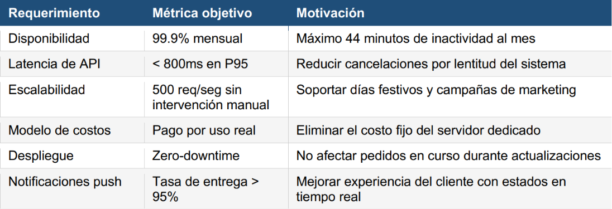
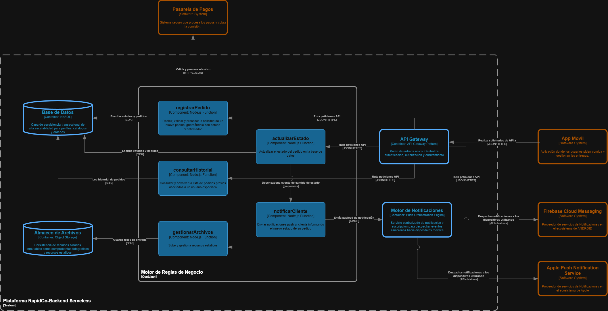

# Backend Serverless para Aplicación Móvil - RapidGo

**Curso:** Computación en la Nube | Semestre 2026-1  
**Profesor:** Julian David Florez Sanchez  
**Integrantes del grupo:**  
* Treycy Bridney Andres Sebastian  
* Adler Clin Omonte Sanchez  

---

## Matriz de Control de Cambios

| ID | Responsable | Observación | Fecha |
|:---:|---|---|---|
| 01 |Adler Omonte Sanchez y Treycy Andres Sebastian |Inicializacion del Caso de Uso | 07/05/2026 |
| 02 | | | |
| 03 | | | |

---

## Índice

1. [Caso de Uso](#caso-de-uso)
   - [3.1 Descripción de la empresa](#31-descripción-de-la-empresa)
   - [3.2 Situación tecnológica actual y problemas identificados](#32-situación-tecnológica-actual-y-problemas-identificados)
   - [3.3 Requerimientos para la nueva arquitectura](#33-requerimientos-para-la-nueva-arquitectura)
   - [3.4 Restricciones del proyecto](#34-restricciones-del-proyecto)
2. [Modelo C4](#modelo-c4)
   - [C1 - Contexto](#c1---contexto)
   - [C2 - Contenedores](#c2---contenedores)
   - [C3 - Componentes](#c3---componentes)
3. [Decisiones Arquitectónicas (ADRs)](#decisiones-arquitectónicas-adrs)
4. [Evidencias de Implementación](#evidencias-de-implementación)
5. [Conclusiones](#conclusiones)

---

## Caso de Uso

### 3.1 Descripción de la empresa
RapidGo es una startup colombiana de servicios de domicilios fundada en 2022 que opera actualmente en Medellín, Manizales y Pereira. La plataforma conecta a clientes con restaurantes y tiendas locales a través de una aplicación móvil disponible en Android e iOS, desarrollada en React Native, y cuenta con una red de 340 repartidores activos.

En sus primeros dos años de operación, RapidGo procesó en promedio 1.200 pedidos diarios con picos de hasta 4.500 pedidos en días festivos y fines de semana. Su modelo de negocio cobra una comisión del 18% por pedido completado, lo que hace que la disponibilidad del sistema sea directamente proporcional a sus ingresos: cada minuto de caída representa pérdidas estimadas de $180.000 COP en horas pico.

### 3.2 Situación tecnológica actual y problemas identificados
El backend actual es una aplicación monolítica en Node.js desplegada en un servidor dedicado en un datacenter de Medellín. El equipo de tecnología ha documentado los siguientes problemas críticos que bloquean el crecimiento de la empresa:

* **Escalabilidad manual:** En horas pico (12m-2pm y 6pm-9pm) el servidor se satura y el tiempo de respuesta de la API supera los 8 segundos, generando cancelaciones espontáneas de pedidos estimadas en un 12% del tráfico.
* **Costo fijo ineficiente:** El servidor dedicado cuesta $4.200.000 COP mensuales independientemente del tráfico. En horas de baja demanda (2am-8am) el uso de CPU no supera el 4%, lo que representa un desperdicio significativo de recursos.
* **Despliegues con tiempo de inactividad:** Cualquier actualización del backend requiere 20-30 minutos de inactividad programada, impactando ventas nocturnas y generando mala experiencia de usuario.
* **Notificaciones no confiables:** El sistema actual de push notifications tiene una tasa de entrega del 67% debido a la falta de integración directa con FCM y APNs, generando confusión en clientes sobre el estado de sus pedidos.
* **Sin tolerancia a fallos:** No existe redundancia ni plan de recuperación. Un fallo de hardware implica caída total del servicio con tiempos históricos de restauración de 2 a 6 horas.
* **Deuda técnica en autenticación:** El manejo de tokens JWT está implementado de forma artesanal en el monolito, sin un API Gateway centralizado, lo que dificulta agregar nuevos clientes (app web, API pública) en el futuro.

### 3.3 Requerimientos para la nueva arquitectura
El equipo directivo de RapidGo ha definido los siguientes requerimientos no funcionales que la nueva arquitectura debe cumplir. El grupo debe verificar en los ADRs que las decisiones tomadas satisfacen estos requerimientos:

### 3.4 Restricciones del proyecto
El grupo debe considerar estas restricciones al tomar las decisiones documentadas en los ADRs. Ignorar una restricción sin justificarlo explícitamente en el ADR correspondiente se considera un error de diseño:

* **Stack tecnológico:** El equipo de desarrollo de RapidGo tiene experiencia en Node.js y Python, pero no en Java ni .NET. Las Functions deben implementarse en uno de estos lenguajes.
* **Presupuesto inicial limitado:** Se deben priorizar servicios con capa gratuita. El gasto mensual en Azure no debe superar los $50 USD durante la fase piloto.
* **Migración de Base de Datos:** La base de datos actual es MySQL relacional con 3 años de datos históricos. Si se propone un cambio de paradigma (relacional a NoSQL), debe estar explícitamente justificado en el ADR-02.
* **Cumplimiento normativo y latencia:** Los datos de usuarios colombianos deben almacenarse en la región *Brazil South* o *East US* por latencia y consideraciones de soberanía de datos.
* **Compatibilidad de cliente:** La app móvil en React Native no se rediseñará. La nueva API debe mantener compatibilidad con los contratos de endpoints actuales (mismas rutas y estructura de respuesta JSON).
* **Operación de Infraestructura:** El equipo de infraestructura es de una sola persona. La solución debe minimizar la carga operativa y evitar servicios que requieran administración manual de servidores o clústeres.

---

## Modelo C4

### C1 - Contexto

### Descripción del Modelo C1 (Contexto del Sistema)

El presente diagrama de contexto modela a RapidGo como un sistema de caja negra, identificando claramente a los actores principales como cliente, repartidor, administrador y sus interacciones con los sistemas externos como app móvil, pasarela de pagos, FCM, APNS.

**Componentes:**

* **Sistema Central RapidGo:** Es el núcleo orquestador que centraliza la lógica de negocio, procesa los pedidos y almacena la información, sirviendo como único punto de entrada para las plataformas cliente.

**Actores:**

* **Administrador,Clientes y Repartidores:** Interactúan de forma indirecta con el sistema central utilizando la App Móvil como interfaz para configurar la plataforma, solicitar pedidos y actualizar estados segun el rol.

**Sistemas Externos:**

* **App Móvil:** Se modela como un sistema externo dado que está desarrollada en React Native y no será rediseñada y actúa como el cliente principal que consume la API del backend mediante JSON/HTTPS.
* **Pasarela de Pagos:** Plataforma segura externa encargada de procesar las transacciones financieras y cobrar la comisión del 18% correspondiente al modelo de negocio.
* **Servicios de Notificaciones (FCM y APNS):** Proveedores de infraestructura para el ecosistema Android e iOS. El backend se comunica con ellos para despachar alertas en tiempo real, solucionando los problemas de entrega del sistema anterior.

### C2 - Contenedores

### Descripción del Modelo C2 (Contenedores)

El presente diagrama de contenedores desglosa el interior del sistema "Plataforma RapidGo-Backend Serverless", mostrando las piezas arquitectónicas encargadas de ejecutar la lógica de negocio y los protocolos de comunicación establecidos entre ellas.

**Punto de Entrada y Actores:**

* **Usuarios (Administrador, Repartidores, Clientes):** Interactúan a través de la Interfaz de Usuario (UI) de la App Móvil unificada.
* **App Móvil:** Funciona como el cliente principal desarrollado en React Native. Centraliza las interacciones de todos los roles y realiza las solicitudes hacia la plataforma mediante contratos JSON/HTTPS.

**Contenedores Lógicos Internos:**

* **API Gateway:** Actúa como el punto de entrada único al backend. Su responsabilidad es recibir las peticiones externas, gestionar la seguridad en la autenticación y autorización y enrutar el tráfico mediante HTTPS hacia el nivel de procesamiento.
* **Motor de Reglas de Negocio:** Contenedor de cómputo Serverless que ejecuta la lógica de dominio central bajo demanda
* **Base de Datos (NoSQL):** Capa de persistencia transaccional altamente escalable. El motor de reglas de negocio lee y escribe en ella utilizando un SDK para gestionar perfiles, catálogos y el ciclo de vida de las órdenes.
* **Almacén de Archivos (Object Storage):** Repositorio inmutable que se comunica vía HTTPS, encargado de la persistencia de recursos binarios como comprobantes fotográficos de entrega y recursos estáticos.
* **Motor de Notificaciones (Push Orchestration):** Servicio de publicación y suscripción que recibe comandos asíncronos vía AMQP desde el motor de negocio. Centraliza y orquesta los eventos que deben enviarse a los usuarios.

**Sistemas Externos de Interacción:**

* **Pasarela de Pagos:** Recibe de forma segura los datos de cobro vía HTTPS para procesar la comisión correspondiente al modelo de negocio de RapidGo.
* **Servicios Push (FCM y APNS):** Reciben las cargas de trabajo despachadas por el Motor de Notificaciones mediante APIs nativas para entregar alertas en tiempo real a los ecosistemas Android e iOS.

### C3 - Componentes

### Descripción del Modelo C3 (Componentes)

El presente diagrama de componentes hace "zoom" dentro del contenedor "Motor de Reglas de Negocio", detallando las unidades individuales encargadas de ejecutar la lógica de dominio específica del sistema. Estas piezas están diseñadas para operar de forma independiente, ejecutarse bajo demanda y escalar según el volumen de peticiones.

**Componentes Internos (Funciones de Procesamiento):**

* **registrarPedido:** Unidad encargada de recibir, validar y procesar la solicitud de un nuevo pedido proveniente del punto de entrada unificado. Interactúa con la pasarela de pagos para procesar el cobro y persiste el pedido en la Base de Datos con el estado inicial "confirmado".
* **actualizarEstado:** Unidad responsable de recibir solicitudes para modificar el ciclo de vida de un pedido. Actualiza el registro en la base de datos y, tras una operación exitosa, desencadena un evento interno para notificar el cambio.
* **consultarHistorial:** Unidad de solo lectura dedicada a consultar la base de datos y devolver la lista de pedidos previos asociados a un usuario específico.
* **notificarCliente:** Unidad activada por eventos de cambio de estado. Se encarga de construir y enviar la carga de datos de la alerta hacia el Motor de Notificaciones, para informar al cliente en tiempo real.
* **gestionarArchivos:** Unidad encargada de recibir y gestionar la subida de recursos estáticos, tales como las fotos de los comprobantes de entrega, almacenándolas de forma segura en el Almacén de Archivos.

**Interacciones con otros Contenedores y Sistemas:**

* **Punto de Entrada (API Gateway):** Enruta las peticiones de red entrantes desde la App Móvil hacia las unidades de procesamiento correspondientes (`registrarPedido`, `actualizarEstado`, `consultarHistorial`, `gestionarArchivos`).
* **Base de Datos:** Las funciones de negocio interactúan con esta capa transaccional para leer historiales y registrar las actualizaciones en el estado de los pedidos.
* **Almacén de Archivos:** Recibe de forma segura los recursos binarios (como las fotos de entrega) procesados por el componente `gestionarArchivos`.
* **Pasarela de Pagos:** Sistema externo consultado directamente por la función `registrarPedido` para validar y procesar el cobro de la comisión correspondiente.
* **Motor de Notificaciones:** Recibe las instrucciones despachadas asíncronamente por la función `notificarCliente` y se encarga de orquestar la entrega final hacia los proveedores de servicios de notificaciones propios de cada plataforma móvil.

# ARCHITECTURE DECISION RECORD (ADR) 1

| Atributo | Detalle |
| :--- | :--- |
| **Fecha** | 09/05/2026 |
| **ADR-01** | Selección de Azure Functions sobre Container Apps para lógica de negocio |
| **Versión** | 1.0 |

## CONTEXTO
El backend actual de RapidGo es una aplicación monolítica en Node.js alojada en un servidor dedicado con un costo fijo ineficiente de $4.200.000 COP mensuales teniendo un cuello de botellas en horas pico, el servidor se satura, generando cancelaciones como el 12% del tráfico por respuestas lentas. Se requiere una arquitectura que garantice una escalabilidad de 500 req/seg automática, adopte un modelo de pago por uso, minimice la carga operativa y no supere el presupuesto piloto de $50 USD.

**Restricciones**
* Restricción 1: El equipo solo tiene experiencia en Node.js y Python
* Restricción 2: El servicio base no debe superar los $50 USD mensuales de la fase piloto.

## ALTERNATIVAS EVALUADAS

| Criterio Estratégico | Azure Functions | Azure App Service | Container Apps |
| :--- | :--- | :--- | :--- |
| **Modelo Financiero - Pago por Uso** Peso [5] | 5 Pts: 25 | 1 Pts: 5 | 4 Pts: 20 |
| **Escalabilidad Autónoma** Peso [5] | 5 Pts: 25 | 3 Pts: 15 | 5 Pts: 25 |
| **Minimizar Carga Operativa** Peso [4] | 5 Pts: 20 | 5 Pts: 12 | 3 Pts: 12 |
| **Despliegues con tiempo de inactividad** Peso [4] | 4 Pts: 16 | 5 Pts: 20 | 5 Pts: 25 |
| **Latencia en frío** Peso [3] | 3 Pts: 9 | 5 Pts: 15 | 3 Pts: 9 |
| **Puntaje Total (105)** | **95** | **67** | **91** |

Se evaluaron tres servicios de cómputo mediante una matriz de decisión ponderada:

1. **Azure Functions (Opción Seleccionada - 95 pts):** Máxima puntuación en Modelo Financiero sobre el Pago por uso, Escalabilidad autónoma y Minimizar la carga operativa. Destaca por minimizar la carga operativa al permitir el despliegue directo de código fuente ya sea por Node.js o Python. Su debilidad radica en la latencia en frío durante las horas de baja demanda.
2. **Azure Container Apps ( 91 pts):** Tiene buen desempeño en escalabilidad y mitigación de Despliegues con tiempo de inactividad, pero tiene una desventaja con el criterio de Minimizar Carga Operativa ya que obliga a la única persona de infraestructura a crear y mantener imágenes de Docker y registros de contenedores.
3. **Azure App Service (67 pts):** Aunque ofrece la mejor latencia al evitar arranques en frío, pero no se alinea al modelo financiero por requerir instancias fijas encendidas, lo cual no aplica sobre el presupuesto piloto de $50 USD

---

## DECISIÓN Y JUSTIFICACIÓN
Se elige Azure Functions (Plan Consumption).

Su arquitectura orientada a eventos resuelve el problema de cuello de botella actual, escalando de forma instantánea y automática para soportar los picos de 500 req/seg sin intervención manual. Al ser un modelo Serverless puro y brindar soporte nativo para Node.js y Python cumple con los requerimientos y restricciones establecidas.

Por otro lado, el modelo de pago por uso real, elimina el desperdicio financiero durante horas de baja demanda y prioriza la capa gratuita de la fase piloto.

## CONSECUENCIAS Y TRADE-OFFS

### Ventajas obtenidas:
* **Soporte automático de picos de 500 req/seg.** Respaldado por el diseño de Functions: *"Escale de forma automática y flexible según el volumen de carga de trabajo"*.
* **Modelo de pago por uso.** Alineado a la promesa del plan de consumo: *"Pague solo por el tiempo de proceso durante la ejecución del código"*.
* **Baja carga operativa.** Cumpliendo la directiva central del servicio: *"Céntrese en el código, no en la infraestructura"*.

### Trade-offs asumidos:
* Impacto en la latencia en las madrugadas.
* Configuración cuidadosa de slots para lograr despliegues sin caídas
* Mayor complejidad para monitorear errores al dividir el monolito

# ARCHITECTURE DECISION RECORD (ADR) 2

| Atributo | Detalle |
| :--- | :--- |
| **Fecha** | 09/05/2026 |
| **ADR-02** | Cosmos DB vs Azure SQL Database para la persistencia de pedidos |
| **Versión** | 1.0 |

## CONTEXTO
Actualmente, la plataforma cuenta con una base de datos MySQL relacional que almacena 3 años de datos históricos. Para la nueva arquitectura, se requiere una capa de persistencia para centralizar los pedidos, usuarios y estados de entrega. Debido a la naturaleza del negocio (restaurantes y tiendas), la base de datos debe soportar un modelo flexible para atributos variables. Adicionalmente, se debe justificar cualquier cambio de paradigma estructural de relacional a NoSQL.

**Restricciones**
* Restricción 1: El presupuesto no debe superar los $50 USD mensuales durante la fase piloto, priorizando servicios con capa gratuita.
* Restricción 2: Los datos deben almacenarse obligatoriamente en la región Brazil South o East US por consideraciones de latencia y soberanía.
* Restricción 3: El equipo de infraestructura es de una sola persona, por lo que se debe minimizar la carga operativa.

## ALTERNATIVAS EVALUADAS

| Criterio Estratégico | Azure Cosmos DB (NoSQL) | Azure SQL Database | Azure Database for MySQL |
| :--- | :--- | :--- | :--- |
| **Modelo flexible para atributos variables** Peso [5] | 5 Pts: 25 | 2 Pts: 10 | 2 Pts: 10 |
| **Presupuesto y Capa Gratuita** Peso [5] | 5 Pts: 25 | 5 Pts: 25 | 1 Pts: 5 |
| **Minimizar Carga Operativa** Peso [4] | 5 Pts: 20 | 5 Pts: 20 | 3 Pts: 12 |
| **Transición de datos históricos (3 años)** Peso [4] | 2 Pts: 8 | 4 Pts: 16 | 5 Pts: 20 |
| **Puntaje Total (90)** | **78** | **71** | **47** |

Se evaluaron tres servicios de persistencia de datos mediante una matriz de decisión ponderada:

1. **Azure Cosmos DB (Opción Seleccionada - 78 pts):** Máxima puntuación en adaptabilidad del modelo de datos y alineación presupuestal que por su motor NoSQL maneja documentos JSON que se adaptan nativamente a las variaciones de los pedidos entre tiendas y restaurantes, tambien cuenta con un Free Tier robusto que asegura la viabilidad financiera, pero tiene una debilidad en la transición de los datos históricos acumulados durante los 3 años de operación.
2. **Azure SQL Database (71 pts):** Excelente opción financiera al ofrecer un tier alternativo gratuito de 32 GB, y facilita en gran medida la migración del esquema desde el motor actual. Sin embargo, su naturaleza relacional penaliza fuertemente el requerimiento de atributos variables, exigiendo diseños complejos como tablas genéricas que degradan el rendimiento.
3. **Azure Database for MySQL (47 pts):** Aunque sería la opción natural para mantener el histórico de datos intacto, queda descartada al no contar con un plan gratuito vitalicio consumiendo el presupuesto del piloto y al mantener la rigidez del modelo relacional frente a las nuevas necesidades de atributos variables.

---

## DECISIÓN Y JUSTIFICACIÓN
Se elige **Azure Cosmos DB** con la API de NoSQL, activando el *Free tier* (1.000 RU/s y 25 GB).

La justificación técnica de este cambio de paradigma de relacional a NoSQL radica en el núcleo del negocio de RapidGo como menciona que los atributos de un pedido de restaurante tiene diferencias estructuralmente de los de una tienda local lo que obliga a un esquema relacional a comportarse de forma dinámica y por eso genera cuellos de botella e índices ineficientes. Cosmos DB, al trabajar nativamente con JSON, se alinea de la mejor forma con los contratos de endpoints de la aplicación móvil en React Native.

Por otro lado la adopción de la capa gratuita garantiza el cumplimiento estricto del límite presupuestal y también  cumple con el criterio de no sobrecargar al único administrador de infraestructura

## CONSECUENCIAS Y TRADE-OFFS

### Ventajas obtenidas:
* **Modelo flexible para atributos variables.** Respaldado por la arquitectura agnóstica de Microsoft: *"Azure Cosmos DB indexa automáticamente todos los datos sin necesidad de administrar esquemas ni índices"*.
* **Alineación total al presupuesto.** Garantizado por las políticas del servicio: *"Obtenga los primeros 1000 RU/s y 25 GB de almacenamiento de forma gratuita en su cuenta"*.
* **Baja carga operativa.** Al ser una base de datos Serverless, elimina la necesidad de configurar servidores de bases de datos o aplicar parches de seguridad al sistema operativo.

### Trade-offs asumidos:
* **Complejidad de migración:** Se requiere diseñar y ejecutar procesos ETL complejos para transformar los 3 años de datos históricos estructurados en MySQL hacia las nuevas colecciones orientadas a documentos NoSQL.
* **Acoplamiento de SDK:** El código en las Azure Functions dependerá del SDK propietario de Cosmos DB para las operaciones CRUD, limitando la portabilidad futura a otras nubes.
* **Riesgo por consumo de RU/s.** Consultas mal diseñadas sin la clave de partición correcta pueden agotar rápidamente los 1.000 RU/s gratuitos, generando latencia adicional.

# ARCHITECTURE DECISION RECORD (ADR) 3

| Atributo | Detalle |
| :--- | :--- |
| **Fecha** | 12/05/2026 |
| **ADR-03** | Selección de Azure API Management vs Exposición directa de las Functions |
| **Versión** | 1.0 |

### CONTEXTO

La arquitectura heredada de RapidGo acopla la validación de tokens JWT dentro de un monolito en Node.js. Al transicionar a una arquitectura serverless, carecemos de un gateway centralizado, lo que genera una superficie de ataque fragmentada y obliga a replicar la lógica de seguridad en cada endpoint. Se requiere desplegar una capa de abstracción perimetral que asuma el enrutamiento y la autenticación, garantizando compatibilidad absoluta con los contratos de la aplicación en React Native (preservando rutas y esquemas JSON), mitigando la saturación de peticiones (throttling) y operando sin requerir mantenimiento continuo de infraestructura.

**Restricciones:**
* **Restricción 1:** Cero refactorización en el cliente; la app móvil debe mantener su contrato de consumo de API intacto.
* **Restricción 2:** Infraestructura gestionada por un único ingeniero; se descartan soluciones que requieran parcheo o administración de clústeres.
* **Restricción 3:** El costo operativo del piloto está limitado a un máximo de $50 USD mensuales.

### ALTERNATIVAS EVALUADAS

| Criterio Estratégico | Azure API Management | Exposición Directa (Functions) | Azure Application Gateway |
| :--- | :--- | :--- | :--- |
| **Centralización y Seguridad (JWT)** Peso [5] | 5 Pts: 25 | 2 Pts: 10 | 4 Pts: 20 |
| **Compatibilidad de Contratos (Enrutamiento)** Peso [5] | 5 Pts: 25 | 3 Pts: 15 | 4 Pts: 20 |
| **Control de Tráfico (Throttling)** Peso [4] | 5 Pts: 20 | 2 Pts: 8 | 4 Pts: 16 |
| **Modelo Financiero / Costo Piloto** Peso [4] | 4 Pts: 16 | 5 Pts: 20 | 1 Pts: 4 |
| **Puntaje Total (90)** | **86** | **53** | **60** |

Se evaluaron tres enfoques de exposición mediante una matriz ponderada:

1. **Azure API Management (Opción Seleccionada - 86 pts):** Actúa como un API Gateway puro. Su motor de políticas permite interceptar el tráfico, validar los claims del JWT y reescribir las URLs antes de tocar el cómputo subyacente. El modelo de facturación Consumption se alinea con arquitecturas serverless.
2. **Exposición Directa de Functions (53 pts):** Económicamente es la opción de menor impacto, pero representa un antipatrón arquitectónico a escala. Descentraliza la validación de identidad, carece de controles globales contra ráfagas de tráfico y expone directamente la topología del backend al cliente.
3. **Azure Application Gateway (60 pts):** Solución robusta de capa 7 con WAF integrado. Sin embargo, su enfoque orientado a red tradicional y su modelo de instancias dedicadas exceden drásticamente tanto la complejidad operativa requerida como el límite presupuestal del piloto.

### DECISIÓN Y JUSTIFICACIÓN

Se elige Azure API Management operando en el tier Consumption.

La decisión se fundamenta en la necesidad imperativa de desacoplar responsabilidades. APIM asume la carga transversal de seguridad (CORS, validación JWT, limitación de tasa), liberando a las Azure Functions para que ejecuten exclusivamente lógica de negocio. Crucialmente, la capacidad de URL rewrite de APIM permite enmascarar la nueva topología de microservicios, cumpliendo la restricción de no alterar los contratos HTTP que actualmente consume la aplicación en React Native. Al elegir el tier de consumo, el costo se ata directamente al tráfico real, viabilizando económicamente el piloto. 

Para cumplir con la restricción de soberanía de datos y latencia, la instancia de APIM se aprovisionará en la región East US (o Brazil South). La elección de East US típicamente ofrece una latencia de red base de ~60-90ms hacia el eje cafetero y Antioquia, lo cual deja un margen de más de 700ms para el procesamiento interno de las Functions (escritas en Node.js/Python), garantizando el cumplimiento de la métrica objetivo de < 800ms en el P95.

### CONSECUENCIAS Y TRADE-OFFS

**Ventajas obtenidas:**
* **Seguridad perimetral desacoplada:** Las peticiones no autenticadas o abusivas son rechazadas en el borde, optimizando el consumo de recursos de las Functions.
* **Transparencia para el cliente:** La app móvil interactúa con los mismos endpoints de siempre; el enrutamiento interno es invisible para el frontend.
* **Evolución sin fricción:** Habilita la futura integración de nuevos clientes (como plataformas web) mediante la creación de nuevos productos y cuotas dentro del mismo Gateway.

**Trade-offs asumidos:**
* **Overhead de latencia:** Introduce un salto de red adicional para procesar las políticas de entrada, aunque típicamente es inferior a 20ms.
* **Complejidad en despliegues:** Obliga al equipo a integrar la gestión de políticas XML dentro del ciclo de vida y los pipelines de CI/CD.
* **Cold Starts de APIM:** En el tier Consumption, tras periodos de inactividad (como la ventana de baja demanda de 2am a 8am), la primera petición sufrirá latencia degradada. Sin embargo, dado que el SLA de < 800ms se mide en el P95 (percentil 95), los picos esporádicos por arranque en frío no penalizarán la métrica general durante las horas pico de 1.200 a 4.500 pedidos.

# ARCHITECTURE DECISION RECORD (ADR) 4

| Atributo | Detalle |
| :--- | :--- |
| **Fecha** | 12/05/2026 |
| **ADR-04** | Selección de Azure Blob Storage vs Azure Files para almacenamiento de archivos |
| **Versión** | 1.0 |

### CONTEXTO

La operativa logística exige un sistema de retención para datos no estructurados, centralizado principalmente en fotografías de comprobantes de entrega subidas por los 340 repartidores activos. Adicionalmente, el sistema debe alojar recursos estáticos (imágenes de productos) y reportes transaccionales. Estos assets requieren alta disponibilidad para su renderizado inmediato en las aplicaciones iOS y Android de los clientes finales. Ante proyecciones de 4.500 pedidos en ventanas de alta demanda, la infraestructura debe escalar de manera invisible, manteniendo un costo marginal y sin requerir aprovisionamiento manual.

**Restricciones:**
* **Restricción 1:** El diseño debe acotarse a un límite financiero estricto de $50 USD mensuales durante la fase de validación.
* **Restricción 2:** Cero administración de sistemas de archivos; el único responsable de infraestructura no gestionará discos, montajes ni servidores de almacenamiento.

### ALTERNATIVAS EVALUADAS

| Criterio Estratégico | Azure Blob Storage | Azure Files | Base de Datos (Base64) |
| :--- | :--- | :--- | :--- |
| **Costo a Gran Escala** Peso [5] | 5 Pts: 25 | 2 Pts: 10 | 1 Pts: 5 |
| **Acceso Nativo HTTP/HTTPS** Peso [5] | 5 Pts: 25 | 1 Pts: 5 | 2 Pts: 10 |
| **Carga Operativa y de Desarrollo** Peso [4] | 4 Pts: 16 | 3 Pts: 12 | 5 Pts: 20 |
| **Escalabilidad y Rendimiento** Peso [3] | 4 Pts: 12 | 4 Pts: 12 | 1 Pts: 3 |
| **Puntaje Total (85)** | **78** | **39** | **38** |

Se evaluaron tres arquitecturas de persistencia mediante una matriz ponderada:

1. **Azure Blob Storage (Opción Seleccionada - 85 pts):** Paradigma de almacenamiento de objetos (Object Storage). Es el estándar para servir archivos multimedia en la web. Ofrece acceso nativo por HTTP/HTTPS y su nivel de redundancia local (LRS) es la opción de almacenamiento en frío/caliente más económica de Azure.
2. **Azure Files (53 pts):** Optimizado para protocolos compartidos (SMB/NFS) típicos de arquitecturas legacy (Lift-and-Shift). Su costo base es significativamente mayor y su modelo de acceso no está diseñado para el consumo directo y masivo desde clientes móviles.
3. **Almacenamiento en Base de Datos (34 pts):** Antipatrón para este caso de uso. Persistir imágenes como cadenas Base64 en Cosmos DB consumiría rápidamente la cuota transaccional, degradaría los tiempos de respuesta de las consultas operativas e inflaría los costos de manera insostenible.

### DECISIÓN Y JUSTIFICACIÓN

Se adopta Azure Blob Storage configurado en el tier LRS Standard (Locally Redundant Storage), desplegado obligatoriamente en la región East US (o Brazil South) para cumplir con las normativas de soberanía de datos de usuarios colombianos. 

La naturaleza de los comprobantes y recursos fotográficos encaja perfectamente en el paradigma de almacenamiento de objetos: son archivos inmutables que no requieren jerarquías complejas ni bloqueos de lectura/escritura a nivel de sistema de archivos. Blob Storage permite entregar los archivos directamente a la aplicación móvil a través de la red perimetral de Azure, reduciendo la carga computacional en el backend. Su integración fluida con Azure Functions mediante Bindings de entrada/salida optimiza la escritura de código, y su esquema de cobro (por GB utilizado e interacciones) asegura el cumplimiento de la restricción presupuestal.

### CONSECUENCIAS Y TRADE-OFFS

**Ventajas obtenidas:**
* **Optimización financiera:** Se garantiza el costo mínimo posible en la nube para persistencia de datos no estructurados, pagando fracciones de centavo por transacción.
* **Descarga del backend (Offloading):** Las imágenes se sirven directamente desde el Storage hacia React Native, evitando que las peticiones pesadas saturen el enrutador o las Functions.
* **Cero fricción operativa:** Al ser una plataforma puramente PaaS, la elasticidad es delegada totalmente al proveedor de nube, cumpliendo con la capacidad operativa del equipo.
* **Compatibilidad nativa con el Stack:** La generación de las firmas de acceso compartido (SAS Tokens) requeridas para la descarga segura se integra de manera nativa y con SDKs oficiales tanto en Node.js como en Python (los únicos lenguajes disponibles para el equipo), sin requerir curvas de aprendizaje adicionales.

**Trade-offs asumidos:**
* **Gestión de control de acceso delegado:** Dado que los comprobantes son privados, se requerirá programar la generación de tokens SAS (Shared Access Signatures) temporales desde el backend para autorizar la descarga segura en el cliente. Además, aunque la descarga directa al cliente móvil (React Native) libera de carga al backend, el tráfico de salida (Egress) desde Blob Storage hacia internet generará un costo variable. Se deberá monitorear que en picos de 4.500 pedidos este rubro no ponga en riesgo el límite presupuestal de $50 USD del piloto.
* **Redundancia limitada al datacenter:** Al usar LRS, la replicación de datos se limita a un único centro de datos. En caso de una caída zonal a nivel de infraestructura física en Azure, los archivos estarán temporalmente indisponibles.

# ARCHITECTURE DECISION RECORD (ADR) 5

| Atributo | Detalle |
| :--- | :--- |
| **Fecha** | 09/05/2026 |
| **ADR-05** | Notification Hubs vs Azure Communication Services para notificaciones push |
| **Versión** | 1.0 |

## CONTEXTO
El sistema actual de notificaciones de RapidGo es inestable, presentando una tasa de entrega del 67% debido a la falta de integración directa con FCM y APNs. Esto genera confusión en los clientes respecto al estado de sus pedidos. Se requiere una arquitectura de mensajería que cumpla con el requerimiento de garantizar una tasa de entrega superior al 95%, mejorando la experiencia del cliente con estados en tiempo real. 

**Restricciones**
* Restricción 1: El presupuesto no debe superar los $50 USD mensuales durante el piloto, priorizando servicios con capa gratuita.
* Restricción 2: El equipo de infraestructura es de una sola persona, exigiendo minimizar la carga operativa.
* Restricción 3: Se debe notificar simultáneamente a dispositivos Android e iOS integrados en la aplicación React Native actual.

## ALTERNATIVAS EVALUADAS

| Criterio Estratégico | Azure Notification Hubs | Azure Communication Services | Azure Web PubSub |
| :--- | :--- | :--- | :--- |
| **Integración nativa FCM/APNs** Peso [5] | 5 Pts: 25 | 4 Pts: 20 | 2 Pts: 10 |
| **Presupuesto y Capa Gratuita** Peso [5] | 5 Pts: 25 | 3 Pts: 15 | 3 Pts: 15 |
| **Confiabilidad de entrega (>95%)** Peso [4] | 5 Pts: 20 | 5 Pts: 20 | 4 Pts: 16 |
| **Minimizar Carga Operativa** Peso [3] | 4 Pts: 12 | 3 Pts: 9 | 2 Pts: 6 |
| **Puntaje Total (85)** | **82** | **64** | **47** |

El análisis de las tres herramientas de mensajería en tiempo real revela un contraste significativo en su enfoque operativo. 

La alternativa ganadora es la opción de **Azure Notification Hubs** con un total de 82 puntos. Su arquitectura está diseñada específicamente para ser un motor de orquestación push, alcanzando la máxima puntuación al abstraer por completo la complejidad de conectarse a Google y Apple de forma simultánea. Además, su alineación con el presupuesto es perfecta gracias a su nivel gratuito.

Por otro lado, **Azure Communication Services** alcanza 64 puntos, presentándose como una plataforma omnicanal sumamente robusta que incluye SMS y llamadas. Sin embargo, su enfoque es demasiado amplio para el problema puntual de RapidGo, carece de una capa gratuita generosa para notificaciones push exclusivas y añade una complejidad innecesaria para un equipo pequeño.

Finalmente, se evaluó **Azure Web PubSub** que obtuvo 47 puntos. Aunque es excelente para conexiones bidireccionales en tiempo real mediante WebSockets, fue penalizado fuertemente debido a que no utiliza los servicios push nativos de los sistemas operativos móviles estando la app en segundo plano, obligando al desarrollador a mantener conexiones activas que drenan la batería del dispositivo del cliente.

---

## DECISIÓN Y JUSTIFICACIÓN
Se elige **Azure Notification Hubs** activando el plan Free tier para la gestión de alertas.

La justificación técnica se fundamenta en su capacidad para unificar la carga útil de los mensajes. En lugar de que las Azure Functions deban compilar un mensaje con el formato específico que exige Google y otro distinto para Apple, Notification Hubs recibe una única solicitud genérica y se encarga de traducirla y enrutarla automáticamente a FCM o APNs. Esto reduce drásticamente las líneas de código a mantener y minimiza la carga operativa del equipo.

A nivel de negocio, la plataforma garantiza el cumplimiento del requerimiento de entrega superior al 95% al contar con reintentos automáticos y telemetría exacta. Simultáneamente, su capa gratuita de un millón de notificaciones al mes absorbe la totalidad del tráfico proyectado para la fase piloto, blindando el presupuesto de los $50 USD.

## CONSECUENCIAS Y TRADE-OFFS

### Ventajas obtenidas:
* **Alta confiabilidad multiplataforma.** Microsoft respalda este servicio asegurando un motor de enrutamiento capaz de enviar alertas masivas de forma rápida y segura a cualquier plataforma móvil.
* **Viabilidad financiera del piloto.** El modelo de precios ofrece un millón de operaciones iniciales sin costo, eliminando cualquier riesgo de impacto en el presupuesto mensual de la empresa.
* **Desacoplamiento del código backend.** Las funciones serverless se liberan de gestionar las credenciales de seguridad individuales de Google y Apple, centralizándolas en el hub.

### Trade-offs asumidos:
* Límite estricto en la capa gratuita que requerirá un monitoreo constante, ya que superar el millón de eventos generará costos adicionales imprevistos.
* Gestión de credenciales de terceros al obligar al equipo de infraestructura a renovar manualmente los certificados de Apple y las claves de Firebase anualmente.
* Dificultad para rastrear errores de entrega individuales si un dispositivo específico pierde la conexión, requiriendo activar configuraciones de telemetría avanzadas.

---
> *Nota: Este documento se irá actualizando conforme avance el desarrollo del proyecto.*
